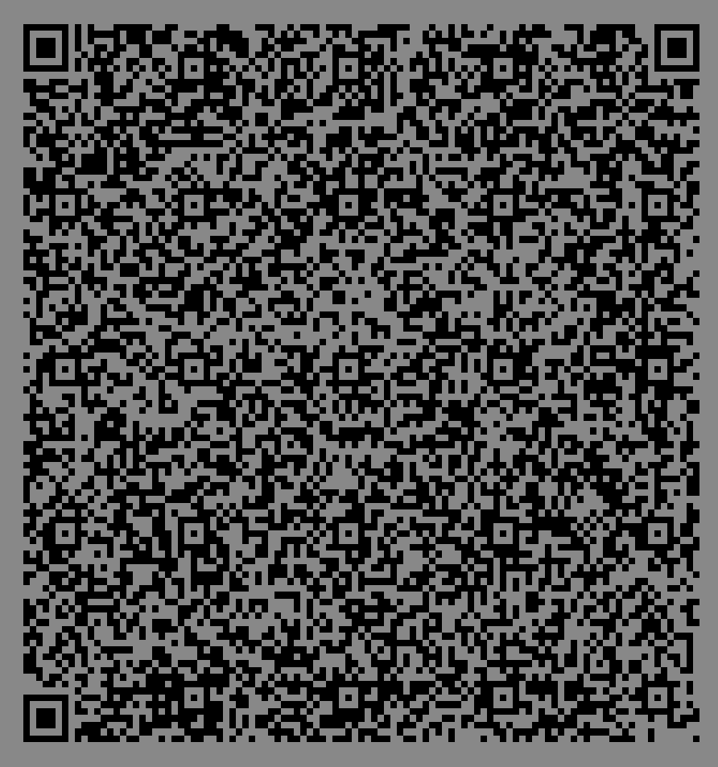

# Ouroboros QR
> [¿Qué es uroboro?](https://es.wikipedia.org/wiki/Ur%C3%B3boro), más info [Mito de Sísifo](https://es.wikipedia.org/wiki/S%C3%ADsifo)

- **Este programa genera un QR de si mismo.**
- Deformación de un [Quine](https://es.wikipedia.org/wiki/Quine_(programa)), con salida en QR
- Autoreferente e Idempotente

## Setup

1. **Crear ambiente virtual:**

   ```bash
   python -m venv venv
   ```

2. **Activa ambiente virtual:**

   ```bash
   source venv/bin/activate
   ```

3. **Instalar dependencias:**

   ```bash
   pip install -r requirements.txt
   ```

## Uso

```bash
python ouroboros-qr.py
```

### Salida




## Licencia

_GNU General Public License, GPLv3._

## Info del Autor

Este repo fue creado en 2025 por
 [José Luis Di Biase](https://github.com/josx), cooperativa de trabajo
 [Cambá](https://www.camba.coop/).
